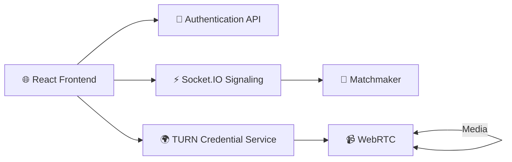
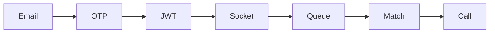
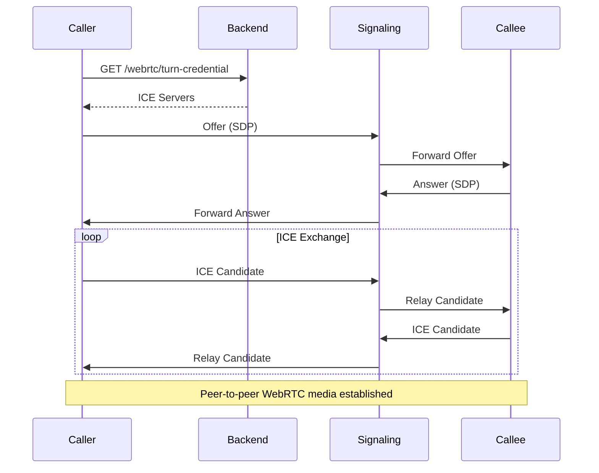
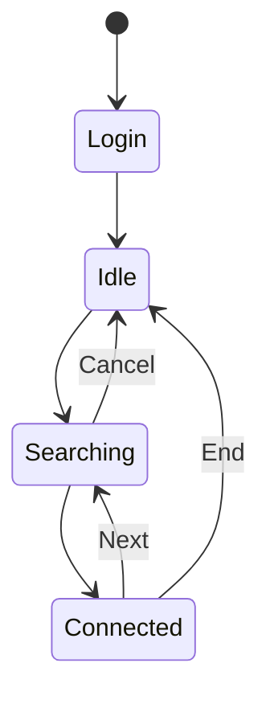

<div align="center">
    
# GradRoulette


### Verified 1:1 Video Networking for Students & Professionals

Connect anonymously with verified students and professionals through
secure peer-to-peer video calls powered by **WebRTC**.

[]()
[]()
[]()
[]()
[]()

🌐 **Frontend:** https://gradroulette.vercel.app/

⚙️ **Backend:** https://gradroulette.onrender.com/


------------------------------------------------------------------------

## Overview

GradRoulette is an Omegle-inspired networking platform designed for
**verified college students and professionals**.

Instead of exposing personal information, users authenticate using
institutional email addresses (or continue as guests), are matched in
real time, and communicate through encrypted peer-to-peer WebRTC video
calls.

------------------------------------------------------------------------

# Features

-   Secure Email OTP Authentication
-   Google Sign-In
-   Guest Mode
-   Anonymous Identity
-   Real-time Matchmaking
-   WebRTC Peer-to-Peer Video
-   STUN/TURN Fallback
-   JWT Authentication
-   Socket.IO Signaling
-   Live Queue Presence

------------------------------------------------------------------------

# Architecture



------------------------------------------------------------------------

# Authentication Flow



------------------------------------------------------------------------

## WebRTC Connection Lifecycle




------------------------------------------------------------------------

# Application State



------------------------------------------------------------------------

# Repository

``` text
backend/
 ├── auth/
 ├── signaling/
 ├── webrtc/
 ├── config/
 └── utils/

frontend/
 ├── screens/
 ├── hooks/
 ├── services/
 └── components/
```

------------------------------------------------------------------------
---

# 🛠 Tech Stack

| Category | Technologies |
|:----------|:-------------|
| **Frontend** | React • Vite • TypeScript |
| **Backend** | Node.js • Express |
| **Real-Time Communication** | Socket.IO |
| **Media** | WebRTC |
| **Authentication** | JWT • Google OAuth • Resend OTP |
| **NAT Traversal** | Metered TURN • Google STUN |
| **Deployment** | Vercel • Render |

---

# 🏛 Architecture

GradRoulette is composed of four primary subsystems that work together to provide secure, anonymous real-time video communication.

| Component | Responsibility |
|:----------|:---------------|
| **Authentication** | Email OTP, Google OAuth, guest sessions, JWT generation, institution verification |
| **Matchmaking** | Queue management, compatibility filtering, guest opt-in logic, live presence |
| **Signaling Server** | Socket.IO signaling, SDP & ICE relay, room lifecycle management |
| **WebRTC Engine** | Peer-to-peer media, TURN fallback, secure ICE credential retrieval |

---

# 📡 REST API

| Method | Endpoint | Description |
|:------:|:---------|:------------|
| `POST` | `/auth/request-otp` | Request an email verification code |
| `POST` | `/auth/verify-otp` | Verify OTP and obtain a JWT |
| `POST` | `/auth/google-login` | Authenticate using Google |
| `POST` | `/auth/guest-session` | Start an anonymous guest session |
| `GET` | `/webrtc/turn-credential` | Retrieve temporary TURN credentials |
| `GET` | `/health` | Backend health check |

---

# 🚀 Running Locally

### Clone the repository

```bash
git clone https://github.com/<your-username>/GradRoulette.git
cd GradRoulette
```

### Backend

```bash
cd backend
npm install
npm run dev
```

Runs on **http://localhost:4000**

### Frontend

```bash
cd frontend
npm install
npm run dev
```

Runs on **http://localhost:5173**

---

# 🌍 Deployment

| Component | URL |
|:----------|:----|
| **Frontend** | https://gradroulette.vercel.app |
| **Backend API** | https://gradroulette.onrender.com |
| **Health Check** | https://gradroulette.onrender.com/health |

---

# 📸 Screenshots

| Login | Matchmaking |
|:------:|:-----------:|
| *Coming Soon* | *Coming Soon* |

| Video Call | Mobile |
|:----------:|:------:|
| *Coming Soon* | *Coming Soon* |

---

# 📄 License

Licensed under the **MIT License**.
