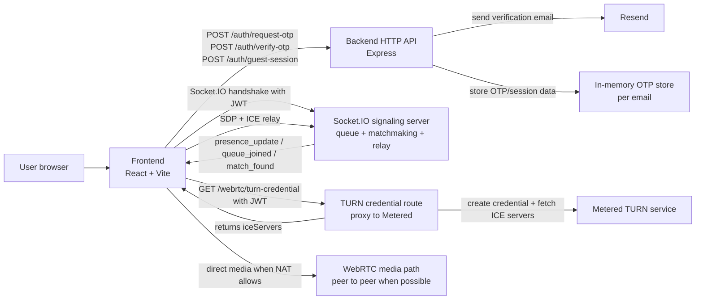
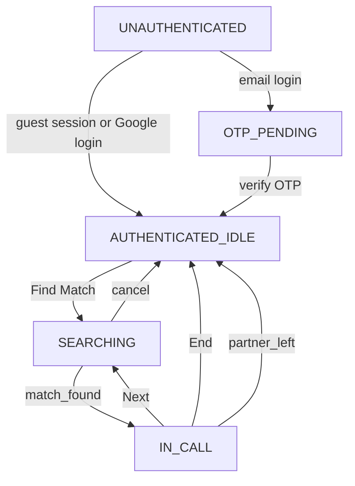
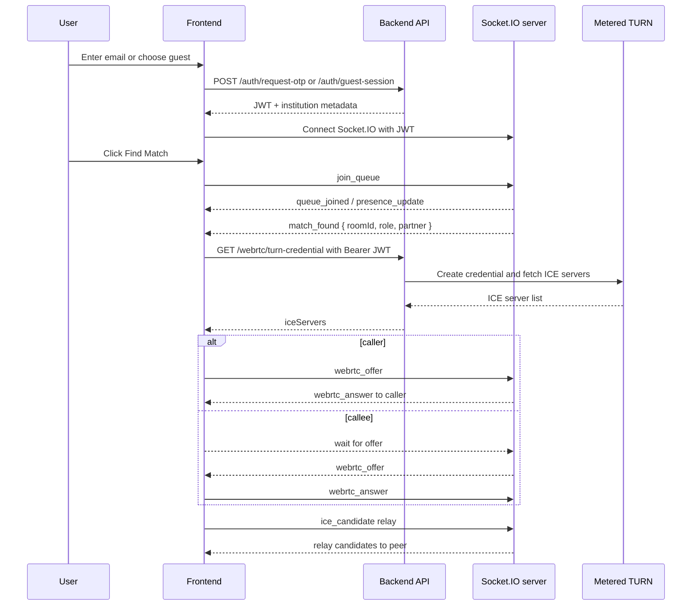

# GradRoulette

Verified-identity 1:1 video chat for students and professionals.

GradRoulette is a TypeScript web app built around three moving parts:

- `backend`: an Express + Socket.IO server that handles auth, queueing, matchmaking, and signaling
- `frontend`: a React + Vite client that drives the login flow, queue UI, and WebRTC call experience
- `production_guide.md`: a deployment-oriented companion document for hosting and live testing

The current codebase implements the core MVP loop end to end: a user authenticates with email OTP, a guest can join without email, the signaling server matches users in-memory, and the browser establishes a direct WebRTC call with TURN fallback support.

## What This App Does

GradRoulette lets users enter a short-lived identity session, choose who they want to meet, and jump into a 1:1 video call. The system is designed to keep identifiers minimal and session-scoped:

- verified users are resolved from their email domain into an institution or company identity
- guests can join with no email, but verified users must explicitly opt in to guest matches
- matching happens in memory only and disappears when the backend restarts
- the remote peer only learns the partner's institution name and category, not email or socket details

## High-Level Architecture



## Repository Layout

The current tree is split into backend and frontend packages. There is not yet a physical `shared/` package in the repo, even though the architecture spec describes one. Today, shared shapes are duplicated in `backend/src/types.ts` and `frontend/src/types.ts`.

```text
backend/
  src/
    server.ts
    auth/
    signaling/
    webrtc/
    utils/
    config/
  tests/
frontend/
  src/
    App.tsx
    hooks/
    screens/
    services/
production_guide.md
render.yaml
```

## Backend Overview

The backend is a single Node process that serves REST endpoints and Socket.IO on the same HTTP server.

### Server bootstrap

[backend/src/server.ts](backend/src/server.ts) creates the Express app, attaches Socket.IO, enables JSON parsing and CORS, exposes a `/health` endpoint, and starts two recurring loops:

- matchmaking runs every second
- presence counts are broadcast every 3 seconds

### REST endpoints

| Route | Purpose | Notes |
| --- | --- | --- |
| `POST /auth/request-otp` | Request a 6-digit verification code | Validates the email domain, rate limits per email, and sends mail through Resend or logs locally in dev |
| `POST /auth/verify-otp` | Verify the code and mint a JWT | Returns the token plus institution name and category |
| `POST /auth/guest-session` | Create an anonymous guest JWT | Enforces a simple IP-based guest session throttle |
| `POST /auth/google-login` | Verify Google ID token and mint a JWT | Present in the current codebase as an extra login path when Google client IDs are configured |
| `GET /webrtc/turn-credential` | Return ICE servers for WebRTC | Authenticated with the existing JWT and backed by Metered when configured |
| `GET /health` | Health check | Useful for deployment platforms like Render |

### Authentication flow

[backend/src/auth/routes.ts](backend/src/auth/routes.ts) contains the current auth behavior:

- email OTP uses `resolveInstitution(email)` to determine whether the address belongs to a known student institution or should be treated as a professional domain
- OTPs are stored in memory, expire after 5 minutes, and are limited to a finite number of verification attempts
- guest sessions do not require email, but they are rate limited by IP to reduce trivial abuse
- the Google login route exchanges a Google credential token for the same anonymous JWT shape used by the email flow
- the issued JWT contains only `userId`, `institutionName`, and `category`, and expires in 24 hours

The email helper currently uses Resend if `RESEND_API_KEY` is present and falls back to logging the OTP in development.

### Domain resolution

[backend/src/auth/resolveInstitution.ts](backend/src/auth/resolveInstitution.ts) is the pure lookup function used by auth. It reads:

- [backend/src/config/institutions.json](backend/src/config/institutions.json)
- [backend/src/config/blockedProfessionalDomains.json](backend/src/config/blockedProfessionalDomains.json)

Current behavior:

- a known institution domain resolves as `category: "student"`
- a blocked consumer domain is rejected
- any other non-blocked domain resolves as `category: "professional"` and derives a display name from the domain prefix

The current seed list includes a small set of Indian institutions plus a sandbox Gmail entry used during development.

### Signaling and matchmaking

[backend/src/signaling/socketMiddleware.ts](backend/src/signaling/socketMiddleware.ts) validates the JWT during Socket.IO handshake and registers an `activeUsers` entry for the socket. The server currently keeps all runtime state in memory:

- `activeUsers`: connected users keyed by socket ID
- `waitingQueue`: queued users in FIFO order
- `activeRooms`: matched pairs keyed by room ID

[backend/src/signaling/matchmaker.ts](backend/src/signaling/matchmaker.ts) contains the match logic:

- runs on a 1 second loop
- checks mutual compatibility in both directions
- respects guest gating separately from filter matching
- widens a queue preference to `anyone` after 20 seconds in queue
- creates a room and assigns caller/callee roles based on who has waited longer

The compatibility rule is intentionally symmetric:

- `students_only` only matches a student on the other side
- `professionals_only` only matches a professional on the other side
- guests can match guests
- guests can match verified users only if the verified user has `allowGuests: true`

[backend/src/signaling/eventHandlers.ts](backend/src/signaling/eventHandlers.ts) wires the Socket.IO event contract:

| Event | Direction | Purpose |
| --- | --- | --- |
| `join_queue` | client to server | Enter the waiting queue with a filter preference |
| `queue_joined` | server to client | Confirm queue entry and return position |
| `queue_left` | server to client | Confirm queue exit |
| `presence_update` | server to client | Broadcast live queue counts |
| `match_found` | server to client | Notify both peers of a room and role |
| `webrtc_offer` | client to server and server to client | Relay the caller's SDP offer |
| `webrtc_answer` | client to server and server to client | Relay the callee's SDP answer |
| `ice_candidate` | client to server and server to client | Relay ICE candidates between peers |
| `leave_call` | client to server | End a call and return to idle state |
| `partner_left` | server to client | Notify the remaining peer after a disconnect or leave |
| `error` | server to client | Report auth, payload, or room errors |

### TURN credentials

[backend/src/webrtc/turnCredentialRoute.ts](backend/src/webrtc/turnCredentialRoute.ts) is the backend-only TURN helper. It:

- verifies the user's JWT
- calls Metered with the secret key from backend env vars when configured
- fetches the generated ICE server list
- returns `iceServers` to the frontend
- falls back to Google STUN servers if the Metered configuration is missing or fails

This means the frontend never sees the Metered secret key. It only receives the resulting ICE servers for a specific session.

## Frontend Overview

The frontend is a React + Vite app with a screen-driven state machine. It uses localStorage for auth persistence in the current codebase and reconnects the socket after reload when a token exists.

### Screen flow



### Main screen responsibilities

- [frontend/src/screens/LoginScreen.tsx](frontend/src/screens/LoginScreen.tsx) handles email OTP, guest sessions, and Google sign-in when configured
- [frontend/src/screens/OtpScreen.tsx](frontend/src/screens/OtpScreen.tsx) handles six-digit code entry and verification
- [frontend/src/screens/FilterScreen.tsx](frontend/src/screens/FilterScreen.tsx) lets verified users pick a matching target and toggle guest matching
- [frontend/src/screens/SearchingScreen.tsx](frontend/src/screens/SearchingScreen.tsx) shows queue state and the widened-search notice
- [frontend/src/screens/CallScreen.tsx](frontend/src/screens/CallScreen.tsx) renders local and remote video, call controls, and the partner identity banner

### Client hooks

- [frontend/src/hooks/useMediaStream.ts](frontend/src/hooks/useMediaStream.ts) requests camera and microphone once per session and reuses the stream until explicitly stopped
- [frontend/src/hooks/useSocket.ts](frontend/src/hooks/useSocket.ts) owns the Socket.IO client, listens for server events, and exposes queue/call helpers
- [frontend/src/hooks/useWebRTC.ts](frontend/src/hooks/useWebRTC.ts) creates the `RTCPeerConnection`, fetches TURN config, buffers early ICE candidates, and performs offer/answer signaling

### WebRTC call setup



The current client implementation buffers ICE candidates until the remote description is set, which avoids the common `addIceCandidate` timing failure.

## Runtime Data Model

The backend currently models sessions, rooms, and queue state with plain TypeScript interfaces and in-memory maps.

### User session

Each active socket maps to a `UserSession` containing:

- `socketId`
- `userId`
- `institutionName`
- `category`
- `filterPreference`
- `allowGuests`
- `state`
- `roomId`
- `queuedAt`

### Room

Each room contains two participants and a creation timestamp. The remote peer only receives partner metadata, not email or socket identifiers.

### State transitions

Typical server-side transitions are:

- `IDLE` -> `QUEUED` on `join_queue`
- `QUEUED` -> `MATCHED` when the matchmaker creates a room
- `MATCHED` -> `IN_CALL` when the caller sends the SDP offer
- `IN_CALL` -> `IDLE` on `leave_call`, `partner_left`, or disconnect cleanup

## Environment Variables

### Backend

```bash
PORT=4000
JWT_SECRET=your_32_plus_character_secret
RESEND_API_KEY=your_resend_key
METERED_SECRET_KEY=your_metered_secret_key
METERED_APP_DOMAIN=gradroulette.metered.live
GOOGLE_CLIENT_ID=your_google_oauth_client_id
```

### Frontend

```bash
VITE_SIGNALING_SERVER_URL=https://your-backend.example.com
VITE_GOOGLE_CLIENT_ID=your_google_oauth_client_id
```

If the frontend is run locally and `VITE_SIGNALING_SERVER_URL` is not set, it falls back to the current hostname on port 4000.

## Local Development

Run the backend and frontend in separate terminals.

### Backend

```bash
cd backend
npm install
npm run dev
```

Other backend scripts:

- `npm run build` compiles TypeScript to `dist/` and copies the config JSON files
- `npm run start` runs the built server
- `npm test` runs Vitest

### Frontend

```bash
cd frontend
npm install
npm run dev
```

Other frontend scripts:

- `npm run build` compiles TypeScript and builds the Vite bundle
- `npm run preview` serves the production build locally
- `npm run lint` runs ESLint

## Deployment

The repository includes [render.yaml](render.yaml), which already points Render at the backend root directory and health check route.

Recommended production setup:

- deploy `backend` as a persistent Node service so Socket.IO can hold open connections
- deploy `frontend` as a static Vite build on Vercel, Netlify, or a similar host
- restrict CORS to the deployed frontend origin before going public
- set the backend environment variables from the section above
- keep Metered secret material server-side only

The backend currently falls back to STUN-only if TURN credentials cannot be created, which keeps the app usable even when Metered is unavailable.

## Testing Notes

The current backend package is configured for Vitest. The most important pure units in the repo are:

- `resolveInstitution(email)`
- `isCompatible(userA, userB)`
- the in-memory auth and queue helpers around them

The spec that guided this project also calls for schema-level validation. The present codebase mirrors payload types in TypeScript interfaces rather than a dedicated Zod-backed `shared/` package, so that is the main architectural gap to close if you want stricter runtime validation later.

## Important Implementation Details

- `userId` is a generated UUID and is the only stable anonymous identifier used across auth, signaling, and TURN labeling
- the remote peer sees only `institutionName` and `category`
- guests are always forced into the `anyone` filter on the server side
- verified users can opt into guest matches with `allowGuests`
- the matchmaker widens long-waiting searches after 20 seconds
- queue and room state are in-memory only and are lost on restart
- the frontend keeps auth state in localStorage in the current implementation

## Current Code vs. The Architecture Spec

The architecture spec that accompanied this repo is more strict than the current code in a few places. The README reflects the code that actually exists today, so these are worth knowing:

- the code currently supports Google login in addition to OTP and guest sessions
- the repo does not yet contain a physical `shared/` workspace package
- runtime payload validation is still interface-based rather than Zod-based
- the TURN route currently falls back to Google STUN if Metered is misconfigured
- `institutions.json` currently includes a Gmail sandbox entry for development

Those differences do not block the current app from running, but they matter if you are aligning the implementation back to the stricter spec.

## Quick Start Summary

1. Start the backend in `backend/`.
2. Start the frontend in `frontend/`.
3. Configure `JWT_SECRET`, `RESEND_API_KEY`, `METERED_SECRET_KEY`, and `GOOGLE_CLIENT_ID` on the backend if you want the full auth options.
4. Set `VITE_SIGNALING_SERVER_URL` and, optionally, `VITE_GOOGLE_CLIENT_ID` on the frontend.
5. Open the app, authenticate, pick a filter, and join a queue.

If you want, I can also turn the README into a cleaner project landing page style doc or update `production_guide.md` so both documents match each other.